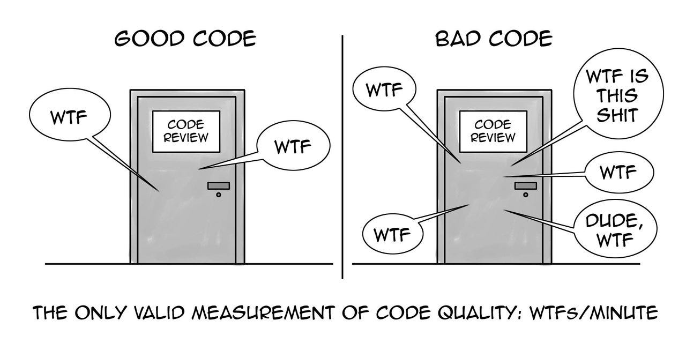
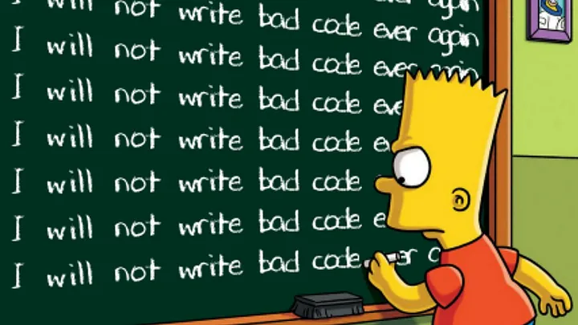

<style>
pre {
  font-size: 85%;
}
</style>

# **Clean Code and Best Practices**
in Python :snake:

<br>
<p align="center">
  
</p>

---

# Agenda

- **Definition of Clean Code**
- **Why does Clean Code Matter?**
- **How to Write Clean Code?**
    - **Key Principles**
    - **Code Smells**
- **Tooling**

---

# What is Clean Code?

Code that is easy to read, understand, and modify.

---

# What is Clean Code?

Code that is easy to **read**, **understand**, and **modify**.

<br>

- Readability: naming, formatting, structure
- Understandability: self-doc, simplicity, patterns
- Modifiability: modular, loose, reusable 

---

# Why does Clean Code Matter?

"Code is read more often than it is written."<br>- Robert C. Martin

---

# Why does Clean Code Matter?

"Code is read more often than it is written."<br>- Robert C. Martin

<br>

- Reduces technical debt :moneybag:
- Improves collaboration in teams :handshake:
- Leads to fewer bugs and faster debugging :bug:

---

# Readability First

- Use consistent naming conventions

---

# Readability First

- Use consistent naming conventions
- Follow PEP 8 (Python Enhancement Proposal 8)

Some key points:
- Indentation: 4 spaces
- Naming conventions: `snake_case` for variables and functions, `CamelCase` for classes, `UPPERCASE` for constants
- Underscores: Prefix private variables with an underscore `_` <br>(never use `__` because it invokes name mangling)

---

# How to Write Clean Code? :pencil2:

Let's look at some practical examples in Python :snake:

<p align="center">
  
</p>

---

<br><br><br>
<h1 align="center">Key Principles 🔑</h1>

---

# Key Principles

**KISS** - *Keep It Simple, Stupid* :brain:  

Avoid overcomplicating solutions. Write code that is straightforward and easy to understand.  

---

# Key Principles

**KISS** - *Keep It Simple, Stupid* :brain:

```python
# Bad (overcomplicated)
def greet_user(name, title="Mr.", middle_name="", suffix=""):
    print(f"Hello, {title} {middle_name} {name} {suffix}!")

greet_user("Doe", title="Dr.", middle_name="John", suffix="PhD")
```

---

# Key Principles

**KISS** - *Keep It Simple, Stupid* :brain:

```python
# Bad (overcomplicated)
def greet_user(name, title="Mr.", middle_name="", suffix=""):
    print(f"Hello, {title} {middle_name} {name} {suffix}!")

greet_user("Doe", title="Dr.", middle_name="John", suffix="PhD")

# Good (simple)
def greet_user(name):
    print(f"Hello, {name}!")

greet_user("Dr. John Doe PhD")
```

---
# Key Principles

**DRY** - *Don't Repeat Yourself* :repeat:

Avoid duplicating code. Instead, create reusable functions or classes to encapsulate common logic.

---

# Key Principles

**DRY** - *Don't Repeat Yourself* :repeat:

```python
# Bad (repeated logic)
numbers1 = [1, 2, 3, 4, 5]
average1 = sum(numbers1) / len(numbers1)

numbers2 = [6, 7, 8, 9, 10]
average2 = sum(numbers2) / len(numbers2)
```

---
# Key Principles

**DRY** - *Don't Repeat Yourself* :repeat:

```python
# Bad (repeated logic)
numbers1 = [1, 2, 3, 4, 5]
average1 = sum(numbers1) / len(numbers1)

numbers2 = [6, 7, 8, 9, 10]
average2 = sum(numbers2) / len(numbers2)

# Good (reusable function)
def calculate_average(numbers):
    return sum(numbers) / len(numbers)

average1 = calculate_average([1, 2, 3, 4, 5])
average2 = calculate_average([6, 7, 8, 9, 10])
```

---

# Key Principles

**YAGNI** - *You Aren't Gonna Need It* :no_entry:

Only implement features that are necessary for the current requirements.

---

# Key Principles

**YAGNI** - *You Aren't Gonna Need It* :no_entry:

```python
# Bad (adding unnecessary functionality)
def search_item(items, query, case_sensitive=False, exact_match=False):
    if case_sensitive:
        result = [item for item in items if query in item]
    else:
        result = [item for item in items if query.lower() in item.lower()]
    if exact_match:
        result = [item for item in result if item == query]
    return result

search_item(["apple", "banana", "cherry"], "apple")
```

---

# Key Principles

**YAGNI** - *You Aren't Gonna Need It* :no_entry:

```python
# Bad (adding unnecessary functionality)
def search_item(items, query, case_sensitive=False, exact_match=False):
    if case_sensitive:
        result = [item for item in items if query in item]
    else:
        result = [item for item in items if query.lower() in item.lower()]
    if exact_match:
        result = [item for item in result if item == query]
    return result

# Good (simpler function)
def search_item(items, query):
    return [item for item in items if query.lower() in item.lower()]

search_item(["apple", "banana", "cherry"], "apple")
```

---

<br><br><br>
<h1 align="center">Code Smells 👃</h1>

---

# Naming 

❌ Smell: Lots of comments
<br>

```python
# Bad
def calc(x, y):
    # Calculate the volume of a cylinder by multiplying 3.14159 (= pi) 
    # by the radius x squared and the height y
    return 3.14159 * x * x * y
```

---

# Naming 

❌ Smell: Lots of comments
✅ Fix: Use meaningful names

```python
# Bad
def calc(x, y):
    # Calculate the volume of a cylinder by multiplying 3.14159 (= pi) 
    # by the radius x squared and the height y
    return 3.14159 * x * x * y

# Good
PI = 3.14159

def calculate_volume_of_cylinder(radius, height):
    return PI * (radius ** 2) * height
```

---

# Types

❌ Smell: Untyped variables
<br>

```python
# Good
PI = 3.14159

def calculate_volume_of_cylinder(radius, height):
    return PI * (radius ** 2) * height
```

---

# Types

❌ Smell: Untyped variables
✅ Fix: Use type hints

```python
# Good
PI = 3.14159

def calculate_volume_of_cylinder(radius, height):
    return PI * (radius ** 2) * height

# Even better (with type hints)
PI: float = 3.14159

def calculate_volume_of_cylinder(radius: float, height: float) -> float:
    return PI * (radius ** 2) * height
```

---
<style scoped>
pre {
  font-size: 65%;
}
</style>

# Imprecise Types

❌ Smell: Exesive use of string
<br>

```python
# Bad (using strings for IDs and status)
class Order:
    def __init__(self, user_id: str, order_id: str, status: str):
        self.user_id = user_id
        self.order_id = order_id
        self.status = status

order = Order("user123", "order456", "pending")
```

---
<style scoped>
pre {
  font-size: 65%;
}
</style>

# Imprecise Types

❌ Smell: Exesive use of string
✅ Fix: Use Enum

```python
from enum import Enum

UserId = NewType("UserId", str)
OrderId = NewType("OrderId", str)

class OrderStatus(Enum):
    PENDING = "pending"
    SHIPPED = "shipped"
    DELIVERED = "delivered

class Order:
    def __init__(self, user_id: UserId, order_id: OrderId, status: OrderStatus):
        self.user_id = user_id
        self.order_id = order_id
        self.status = status

order = Order(UserId("user123"), OrderId("order456"), OrderStatus.PENDING)
```

---
<style scoped>
pre {
  font-size: 65%;
}
</style>

# Imprecise Types

❌ Smell: Exesive use of string
✅ Fix: Use Enum and Custom Types

```python
from enum import Enum
from typing import NewType

class Role(Enum):
    MANAGER  = "manager"
    EMPLOYEE = "employee"

UserId = NewType("UserId", str)

class User:
    def __init__(self, user_id: UserId, name: str, role: Role):
        self.user_id = user_id
        self.name = name
        self.role = role

manager = User(UserId("1"), "Max", Role.MANAGER)
employee = User(UserId("2"), "Moritz", Role.EMPLOYEE)
```

---
<style scoped>
pre {
  font-size: 48%;
}
</style>

# Early Return

❌ Smell: Deep nesting
<br>

```python
# Bad (deep nesting)
def process_order(order):
    if order.is_valid():
        if order.has_stock():
            if order.payment_successful():
                order.complete()
                return "Success"
            else:
                return "Payment Failed"
        else:
            return "Out of Stock"
    else:
        return "Invalid Order"
```

---
<style scoped>
pre {
  font-size: 48%;
}
</style>

# Early Return

❌ Smell: Deep nesting
✅ Fix: Use guard clauses

```python
# Bad (deep nesting)
def process_order(order):
    if order.is_valid():
        if order.has_stock():
            if order.payment_successful():
                order.complete()
                return "Success"
            else:
                return "Payment Failed"
        else:
            return "Out of Stock"
    else:
        return "Invalid Order"

# Good (early return)
def process_order(order):
    if not order.is_valid():
        return "Invalid Order"
    if not order.has_stock():
        return "Out of Stock"
    if not order.payment_successful():
        return "Payment Failed"

    order.complete()
    return "Success"
```

---
<style scoped>
pre {
  font-size: 68%;
}
</style>

# Empty Objects

❌ Smell: Returning `None`
<br>

```python
# Bad (using None)
def get_user_data(user_id) -> dict | None:
    user = get_user(user_id)
    if user is None:
        return None
    return user.get_data_dict()
```

---
<style scoped>
pre {
  font-size: 68%;
}
</style>

# Empty Objects

❌ Smell: Returning `None`
<br>

```python
# Bad (using None)
def get_user_data(user_id) -> dict | None:
    user = get_user(user_id)
    if user is None:
        return None
    return user.get_data_dict()

user_data = get_user_data(123)
if user_data:
    age = user_data.get('age')
else:
    age = 0
```

---
<style scoped>
pre {
  font-size: 68%;
}
</style>

# Empty Objects

❌ Smell: Returning `None`
<br>

```python
# Bad (using None)
def get_user_data(user_id) -> dict | None:
    user = get_user(user_id)
    if user is None:
        return None
    return user.get_data_dict()

age = get_user_data(123).get('age', default=0)
```

---
<style scoped>
pre {
  font-size: 68%;
}
</style>

# Empty Objects

❌ Smell: Returning `None`
<br>

```python
# Bad (using None)
def get_user_data(user_id) -> dict | None:
    user = get_user(user_id)
    if user is None:
        return None
    return user.get_data_dict()

age = get_user_data(123).get('age', default=0)  # Error: 'NoneType' object has no attribute 'get'
```

---
<style scoped>
pre {
  font-size: 68%;
}
</style>

# Empty Objects

❌ Smell: Returning `None`
✅ Fix: Use empty objects

```python
# Bad (using None)
def get_user_data(user_id) -> dict | None:
    user = get_user(user_id)
    if user is None:
        return None
    return user.get_data_dict()

# Good (using empty objects)
def get_user_data(user_id) -> dict:
    user = get_user(user_id)
    if user is None:
        return {}
    return user.get_data_dict()

age = get_user_data(123).get('age', default=0)
```

---
<style scoped>
pre {
  font-size: 65%;
}
</style>

# Single Responsiblity

❌ Smell: *or*-functions
<br>

```python
# Bad (does too much)
def encode_or_decode(message, key, do_encode):
    if do_encode:
        # Encoding logic
        ...
    else:
        # Decoding logic
        ...
```

---
<style scoped>
pre {
  font-size: 65%;
}
</style>

# Single Responsiblity

❌ Smell: *or*-functions
✅ Fix: Separate concerns

```python
# Bad (does too much)
def encode_or_decode(message, key, do_encode):
    if do_encode:
        # Encoding logic
        ...
    else:
        # Decoding logic
        ...

# Good (separate concerns)
def encode(message, key):
    # Encoding logic
    ...

def decode(message, key):
    # Decoding logic
    ...
```

---
<style scoped>
pre {
  font-size: 80%;
}
</style>

# Function Arguments

❌ Smell: Too many arguments (> 3)
<br>

```python
# Bad (too many arguments)
def save_user(name, age, email, address):
    ...
```

---
<style scoped>
pre {
  font-size: 80%;
}
</style>

# Function Arguments

❌ Smell: Too many arguments (> 3)
✅ Fix: Use a data structure

```python
# Bad (too many arguments)
def save_user(name, age, email, address):
    ...

# Good (use a data structure)
class User:
    def __init__(self, name, age, email, address):
        self.name = name
        self.age = age
        self.email = email
        self.address = address

def save_user(user: User):
    ...
```

---

# Methods

❌ Smell: Unnecessary self
<br>

```python
# Bad (self is not needed)
class Calculator:
    def add(self, a, b):
        return a + b
```

---

# Methods

❌ Smell: Unnecessary self
✅ Fix: Use static methods

```python
# Bad (self is not needed)
class Calculator:
    def add(self, a, b):
        return a + b

# Good (use static methods)
class Calculator:
    @staticmethod
    def add(a, b):
        return a + b
```

---
<style scoped>
pre {
  font-size: 75%;
}
</style>
# Abstract Details

❌ Smell: Exposing internals
<br>

```python
# Bad (lots of details)
df['age_group'] = None
df.loc[df['age'] <= 18, 'age_group'] = 'child'
df.loc[(df['age'] > 18) & (df['age'] <= 65), 'age_group'] = 'adult'
df.loc[df['age'] > 65, 'age_group'] = 'senior'
```

---
<style scoped>
pre {
  font-size: 75%;
}
</style>

# Abstract Details

❌ Smell: Exposing internals
✅ Fix: Use functions to abstract

```python
# Bad (lots of details)
df['age_group'] = None
df.loc[df['age'] <= 18, 'age_group'] = 'child'
df.loc[(df['age'] > 18) & (df['age'] <= 65), 'age_group'] = 'adult'
df.loc[df['age'] > 65, 'age_group'] = 'senior'
    
# Good (encapsulate details)
def categorize_age(age):
    if age <= 18:
        return 'child'
    elif 18 < age <= 65:
        return 'adult'
    return 'senior'

df['age_group'] = df['age'].apply(categorize_age)
```

---
<style scoped>
pre {
  font-size: 68%;
}
</style>

# Defend Against Mutability

❌ Smell: Mutable return values
<br>

```python
# Bad
class ShoppingCard:
    def __init__(self):
        self.items = []

    def add_item(self, item):
        self.items.append(item)
        return self.items
```

---
<style scoped>
pre {
  font-size: 68%;
}
</style>

# Defend Against Mutability

❌ Smell: Mutable return values
✅ Fix: Return copies of mutable objects

```python
# Bad
class ShoppingCard:
    def __init__(self):
        self.items = []

    def add_item(self, item):
        self.items.append(item)
        return self.items

# Good (defensive copy)
class ShoppingCard:
    def __init__(self):
        self.items = []

    def add_item(self, item):
        self.items.append(item)
        return self.items.copy()
```

---

# Mutable Default Arguments

❌ Smell: Mutable default arguments
<br>

```python
# Bad
def add_item(item, collection=[]):
    collection.append(item)
    print(collection)

add_item(1)
add_item(2)
```

---

# Mutable Default Arguments

❌ Smell: Mutable default arguments
<br>

```python
# Bad
def add_item(item, collection=[]):
    collection.append(item)
    print(collection)

add_item(1)  # [1]
add_item(2)
```

---

# Mutable Default Arguments

❌ Smell: Mutable default arguments
<br>

```python
# Bad
def add_item(item, collection=[]):
    collection.append(item)
    print(collection)

add_item(1)  # [1]
add_item(2)  # [1, 2] - Unexpected!
```

---

# Mutable Default Arguments

❌ Smell: Mutable default arguments
✅ Fix: Use `None` as default value for mutable types

```python
# Bad
def add_item(item, collection=[]):
    collection.append(item)
    print(collection)

# Good
def add_item(item, collection=None):
    collection = collection or []
    collection.append(item)
    print(collection)
```

---

# Format Strings

❌ Smell: String concatenation (and `str.format`)
<br>

```python
name = "Alice"
age = 30

# Bad
message = "Hello, " + name + ". You are " + str(age) + " years old."
```

---

# Format Strings

❌ Smell: String concatenation (and `str.format`)
<br>

```python
name = "Alice"
age = 30

# Bad
message = "Hello, " + name + ". You are " + str(age) + " years old."

# Better
message = "Hello, {}. You are {} years old.".format(name, age)
```

---

# Format Strings

❌ Smell: String concatenation (and `str.format`)
✅ Fix: Use f-strings for cleaner and more readable code

```python
name = "Alice"
age = 30

# Bad
message = "Hello, " + name + ". You are " + str(age) + " years old."

# Better
message = "Hello, {}. You are {} years old.".format(name, age)

# Good
message = f"Hello, {name}. You are {age} years old."
```

---
<style scoped>
pre {
  font-size: 95%;
}
</style>

# Dataclasses

✅ Use dataclasses for simple data structures

```python
# Using classes
class Rectangle:
    def __init__(self, length, width):
        self.length = length
        self.width = width

```

---
<style scoped>
pre {
  font-size: 95%;
}
</style>

# Dataclasses

✅ Use dataclasses for simple data structures

```python
# Using classes
class Rectangle:
    def __init__(self, length, width):
        self.length = length
        self.width = width

# Using dataclasses
from dataclasses import dataclass

@dataclass
class Rectangle:
    length: int
    width: int
```

---

# Dataclasses

Advantages of using dataclasses:

- Automatically generates `__init__`, `__repr__`, `__eq__`, and other special methods
- Reduces boilerplate code
- Improves readability and maintainability

---

# Dataclasses

Advanced features:
- `@dataclass(frozen=True)` for immutability

```python
from dataclasses import dataclass

@dataclass(frozen=True)
class Rectangle:
    length: int
    width: int

r = Rectangle(5, 10)
r.length = 10  # Raises an error
```

---

# Dataclasses

Advanced features:
- `__post_init__` method for custom initialization logic

```python
from dataclasses import dataclass

@dataclass
class Rectangle:
    length: int
    width: int

    def __post_init__(self):
        if self.length <= 0 or self.width <= 0:
            raise ValueError("Length and width must be positive")
```

---

# Dataclasses

Advanced features:
- `field` function for customizing dataclass fields

```python
from dataclasses import dataclass, field

@dataclass
class Rectangle:
    length: int
    width: int
    color: str = "red"
    tags: list = field(default_factory=list)
```

---

<br><br><br>
<h1 align="center">Tooling 🛠️</h1>

---

# Linter and Formatter

**Linters** and **formatters** are essential tools to ensure code quality and consistency.

---

# Linter

- Identify potential issues and code smells
- Enforce coding standards and best practices

Examples:
- `flake8`
- `pylint`
- `mypy`

---

# Formatter

- Automatically format code according to a predefined style guide
- Improve readability and maintainability

Examples:
- `autopep8`
- `black`
- `isort` (import sorting)

---

# Ruff

Ruff combines linters, formatters, and other code quality checks.

Such as `flake8`, `black`, `isort`, ...

Advantages:
- **Speed**: Ruff is optimized for performance, making it very fast
- **Ease of Use**: Simple to set up and use: `ruff check` and `ruff format`

---

# Ruff

```python
import sys  # Unused import
import os   # Unused import

def example_function():
  unused_variable = 42   # Unused variable
  print("Hello World!") 

def another_function( ):
    print( "This is a test" )  # Bad formatting (unnecessary spaces)
example_function()
```

---

# Ruff

```python
import sys  # Unused import
import os   # Unused import

def example_function():
  unused_variable = 42   # Unused variable
  print("Hello World!") 

def another_function( ):
    print( "This is a test" )  # Bad formatting (unnecessary spaces)
example_function()
```

```
I001: Import block is un-sorted or un-formatted
F401: os imported but unused
F401: sys imported but unused
F841: Local variable unused_variable is assigned to but never used
W292: No newline at end of file
```

---

# Ruff

`> ruff check --fix`
`> ruff format`

<br>

```python
def example_function():
    print("Hello World!") 

def another_function():
    print("This is a test")

example_function()
```

---

<br><br><br>
<h1 align="center">Appendix 📚</h1>

---

# Best Practices / Style Guides

- [The Zen of Python](https://www.python.org/dev/peps/pep-0020/)
```
Beautiful is better than ugly.
Explicit is better than implicit.
Simple is better than complex.
Flat is better than nested.
Readability counts.
Special cases aren't special enough to break the rules.
...
```

- [PEP 8 - Style Guide for Python Code](https://peps.python.org/pep-0008/)
- [Google - Python Style Guide](https://google.github.io/styleguide/pyguide.html)

---

# Books

- Clean Code: A Handbook of Agile Software Craftsmanship <br>(Robert C. Martin)
- The Pragmatic Programmer: Your journey to mastery <br>(Andrew Hunt, David Thomas) - *advanced*
- Refactoring: Improving the Design of Existing Code <br>(Martin Fowler)

<br>

*Ranked in order of my personal preference.*

---

<br><br><br>
<h1 align="center">Thank you! 🙌</h1>
