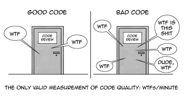

# **Clean Code and Best Practices**
in Python :snake:

<br>
<p align="center">
  
</p>

---

# Agenda

- **Definition of Clean Code**
- **Key Principles**
- **Practical Examples in Python**
- **Tools and Resources**

---

# What is Clean Code?

Code that is easy to **read**, **understand**, and **modify**.

<br>


---

# Why does Clean Code Matter?

"Code is read more often than it is written"<br>- Robert C. Martin

<br>

- Reduces technical debt :moneybag:
- Improves collaboration in teams :handshake:
- Leads to fewer bugs and faster debugging :bug:

---

# Key Principles

- **KISS** - Keep It Simple, Stupid :brain: 
- **DRY** - Don't Repeat Yourself :recycle: 
- **YAGNI** - You Aren't Gonna Need It :no_entry_sign:

---

# How to Write Clean Code?

 


---

# Tooling

**Linters** and **formatters** are essential tools to ensure code quality and consistency.

Linters (e.g., pylint, flake8)
Formatters (e.g., black)
Testing frameworks (e.g., pytest, unittest)

ruff

SonarQube analyses code during the compilation phase and is used with the most commonly used programming languages in software development (Python, C#, Java…).

---

---
---
---
---


```python
print("Hello World")
```


```css
* { box-sizing: border-box; }

h1 { background-color: hotpink; }

.blue { color: dodgerblue; }

body ol li > a { text-decoration: underline; }
```

---

# Best Practices / Style Guides

- [The Zen of Python](https://www.python.org/dev/peps/pep-0020/)
```
Beautiful is better than ugly.
Explicit is better than implicit.
Simple is better than complex.
Flat is better than nested.
Readability counts.
Special cases aren't special enough to break the rules.
...
```

- [PEP 8 - Style Guide for Python Code](https://peps.python.org/pep-0008/)
- [Google - Python Style Guide](https://google.github.io/styleguide/pyguide.html)

---

# Books

- Clean Code: A Handbook of Agile Software Craftsmanship <br>(Robert C. Martin)
- The Pragmatic Programmer: Your journey to mastery <br>(Andrew Hunt, David Thomas) - *advanced*
- Refactoring: Improving the Design of Existing Code <br>(Martin Fowler)

<br>

*Ranked in order of my personal preference.*

---

- Readability
- Simplicity
- Consistency
- Maintainability

## Practical Examples in Python
- Refactoring Techniques
- Code Smells and Solutions
- Best Practices